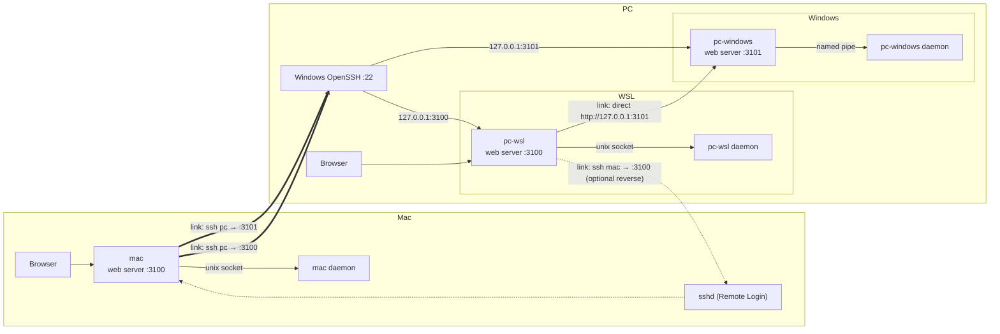

# Multi-node sessions architecture

## Model

- A **node** is one assist install: its own daemon, its own web server, its own sessions, repos and history. The PC has two nodes (WSL and Windows); the Mac has one.
- A node can **link** to any other node. Linking is configured, per direction, in the linking node's config.
- A node's browser shows its own sessions merged with those of every node it links to. With links in both directions, any node's browser shows the same thing.
- WSL → Windows is not special. It is a link like any other, whose transport happens to be loopback.



## Links

A link is a WebSocket (sessions) plus HTTP (panels) to the peer node's **web server**. The web server's WebSocket (`handleSocket.ts`) is already a near-transparent line relay to its daemon, so a link needs no new listener on the peer.

Two transports:

- **direct** — dial a URL. Used for WSL → Windows on the same machine (`http://127.0.0.1:3101`).
- **ssh** — the linking node keeps `ssh -N -L <local>:127.0.0.1:<port> <alias>` up and dials the local end. Keys come from the 1Password SSH agent via `~/.ssh/config`. Peer web servers stay loopback-bound; nothing new listens on the LAN.

Config on the linking node:

```yaml
sessions:
  nodeName: mac # this node's label everywhere; default: OS hostname (+ "-wsl" under WSL)
  links:
    - name: pc-wsl
      ssh: pc # ~/.ssh/config alias
      port: 3100
    - name: pc-windows
      ssh: pc
      port: 3101
```

```yaml
# PC, WSL node
sessions:
  nodeName: pc-wsl
  links:
    - name: pc-windows
      url: http://127.0.0.1:3101
    - name: mac # optional reverse link
      ssh: mac
      port: 3100
```

A link's `name` must match the peer's own `nodeName`; the handshake verifies it.

## Flat, no chaining

- Every node exports **only its own sessions, history and logs**. It never re-exports what it receives over its links.
- A node that wants to see another node links to it directly. The Mac links to `pc-wsl` and `pc-windows` separately rather than seeing Windows "through" WSL.
- This makes symmetric linking loop-free by construction, and every session is exactly one hop from any viewer.
- Session ids are namespaced once, `<node>:<id>` (e.g. `pc-windows:3`). There are no prefix chains to strip.
- A `?node=` panel request arriving over a link is always served locally, never forwarded.

## Each node serves its own panels

- Git status, diff, file, backlog, PR, server-runs requests for a linked node's session are reverse-proxied to that node's web server, which runs them natively.
- Consequence for Windows: Windows repos are read by the Windows node itself, not by WSL through `/mnt/c`. This removes the 9p slowness that currently rules out `git status` on Windows repos (`windowsCwdToWslPath`).
- `repoGroup` (origin + clone) is resolved by the owning node before its sessions snapshot is sent.
- `cwd` stays node-native and is opaque to the viewer.

## What this replaces

The special-case Windows proxy is removed and replaced by a generic link:

| Removed                                                                                                                                               | Replaced by                                                                                            |
| ----------------------------------------------------------------------------------------------------------------------------------------------------- | ------------------------------------------------------------------------------------------------------ |
| `WindowsProxy`, `WindowsConnection`, `WindowsProxyState`, `forwardWindowsCreate`, `forwardWindowsIo`, `handleWindowsClose`, `discoverWindowsSessions` | `NodeLink` (one per configured link)                                                                   |
| Windows TCP bridge (`startWindowsBridge`, `sessions.windowsDaemonPort`, `windowsDaemonHost`)                                                          | the Windows node's web server                                                                          |
| `pwsh.exe` launch of the Windows daemon (`ensureWindowsDaemonRunning`)                                                                                | Windows node's web server (a `native` project-switch web server) running its own `ensureDaemonRunning` |
| `healWindowsDaemon` / `WindowsVersionHealer` (pwsh)                                                                                                   | generic link healer (see Heal)                                                                         |
| `windowsProjectsRoot` transcript discovery, `hasPersistedWindowsSessions`                                                                             | Windows node reports its own history and restores its own sessions                                     |
| `isWindowsCwd` / `shouldProxyToWindows` routing                                                                                                       | explicit `node` on launch messages                                                                     |
| `toGitCwd` / `windowsCwdToWslPath`                                                                                                                    | Windows node reads its own repos                                                                       |
| `w-` id prefix                                                                                                                                        | `<node>:` prefix                                                                                       |
| `WindowsBadge`                                                                                                                                        | generic node badge                                                                                     |
| `sessions.windowsVersionCheck`                                                                                                                        | `sessions.linkVersionCheck`                                                                            |
| `[windows]` log tag                                                                                                                                   | `[<node>]` log tag                                                                                     |

**Upgrade path (no migration):** the old `windows*` keys are dropped on load by `stripLegacyConfigKeys` so existing configs still parse, and persisted `w-` entries in the WSL `sessions.json` are discarded (the Windows node restores its own). Links are added by hand with `assist sessions nodes link`. When a WSL node has no links but a Windows node answers on its port, `assist sessions nodes doctor` says so and prints the exact link command.

**project-switch runs every node's web server.** Today its tray (`hotkey/src/webserver.rs`) manages a single `webserver` (`enabled`, `command`, `distro`, `port`), always launched through `wsl.exe` on Windows. It becomes a list of web servers, each with a target:

- `wsl` (with optional `distro`) — launched via `wsl.exe -- bash -lc`, as today. On the PC: `pc-wsl` on 3100.
- `native` — launched directly on the host (`pwsh` on Windows, the login shell on macOS). On the PC: `pc-windows` on 3101; on the Mac: `mac` on 3100.

Each web server gets its own running check, stop-by-port, and log file, and "View logs" offers each. The Windows node's web server starts the Windows daemon itself via `ensureDaemonRunning`; nothing launches it from WSL any more.

## Heal

- On a version/protocol mismatch where the peer is older, the linking node calls `POST /api/self-update` on the peer. The peer runs `assist update`, then restarts its daemon and web server (via the existing `restartWeb` path). The link reconnects through the breaker and re-handshakes.
- `/api/self-update` and the `hello` handshake are a **frozen contract**: they never change shape, so an old node can always be healed by a new one.
- The existing guard (heal once, then latch) is kept. If the linking node is the older side, it blocks with "update this node".
- If the peer's own watcher has already rebuilt it, heal finds nothing to do and the link just reconnects.

## Nodes in the UI

- Node labels come from each node's own `nodeName`, so a node has the same label on every viewer. The viewer's own node is additionally marked "this machine".
- A repo is identified by its **origin**, merged across nodes; each origin keeps the clone path per node that has one. The repo picker lists each origin once.
- Sidebar cards stay grouped by repo; cards from linked nodes carry a node badge.
- With no links configured there is one node: no machine picker, nothing in the UI mentions nodes, and behaviour is as today.

| Install                        | Nodes seen                    | Machine picker |
| ------------------------------ | ----------------------------- | -------------- |
| Windows only, no links         | `pc-windows`                  | no             |
| WSL only, no links             | `pc-wsl`                      | no             |
| WSL linked to Windows          | `pc-wsl`, `pc-windows`        | yes            |
| Mac, no links                  | `mac`                         | no             |
| Mac linked to both PC nodes    | `mac`, `pc-wsl`, `pc-windows` | yes            |
| PC WSL linked to Windows + Mac | `pc-wsl`, `pc-windows`, `mac` | yes            |

## Top nav changes

- **Replace** the draft / bug / prompt / design mode buttons with a single **+** button that opens the new-session dialog. Its tooltip is titled **New session** and shows the existing hotkeys (`Ctrl+N` / `Alt+N`, per `isNewSessionKey`) as key chips.
- **Add** a **machine picker**, shown only when more than one node is visible. It sets the current node, which top-nav and list actions use by default:
  - Start on a backlog item in the backlog list view.
  - Review (PR) launches and server runs from the top nav.
  - Repo-level views not tied to a session (config, releases, file search with no active card).
- The selected node is remembered per viewer in browser storage; if it is no longer present, it falls back to the local node.
- Each node in the picker shows its link state (connected / connecting / disconnected / version-blocked) with the last error in a tooltip.

## New session dialog

- Gains a **design** mode next to draft / bug / prompt, and a **harness** selector (moved from the top nav's prompt composer dropdowns).
- Gains a **machine** selector, shown only when more than one node is visible. It defaults to the top nav's node and can be changed for this launch without changing the top nav selection.
- Fully keyboard-operable: every control is reachable by Tab, selectors change with arrow keys, `Enter` submits, `Esc` closes.
- The chosen node resolves the launch's `cwd` to that node's clone and sets `node` on the `create` / `create-assist` / `create-run` message; the viewer's daemon forwards it over that node's link.

## Launch routing rules

- Actions on an existing session never ask for a node: resume from history, retry, restart, dismiss, input, and chained backlog phases route by the session's own node (the owning daemon does the chaining).
- Backlog items are node-agnostic (shared Postgres keyed by origin), so any node can run any phase.
- If the chosen node has no clone of the repo, reuse the backlog list's clone affordance (`RepoChip` / `resolveCloneWatch`): dashed `CloudDownloadIcon` treatment, tooltip "Not cloned on <node> — click to clone into <cloneTarget>", and clicking launches `assist backlog clone <origin>` **on that node**. `cloneTarget` comes from that node's backlog summary, so it is node-native. Applies in the backlog list (Start) and in the new-session dialog's machine selector, which lists every node and marks uncloned ones the same way.

## Debuggability

Goal: an agent on **any** node, starting cold, can find which hop is broken without being told the topology.

### Hops

| #   | Hop                                                | Probe                               | Log prefix            |
| --- | -------------------------------------------------- | ----------------------------------- | --------------------- |
| 1   | sshd reach + auth + 1Password agent (ssh links)    | `ssh -o BatchMode=yes <alias> true` | `link <name> ssh:`    |
| 2   | Tunnel bound locally (ssh links)                   | local port accepts                  | `link <name> tunnel:` |
| 3   | Peer web server reachable                          | `GET /api/health`                   | `link <name> web:`    |
| 4   | WebSocket + `hello` (version, protocol, node name) | handshake result                    | `link <name> ws:`     |
| 5   | Peer web server → peer daemon                      | reported in peer health             | (peer's own log)      |
| 6   | Panel proxy (`?node=`)                             | per-request status + duration       | `link <name> http:`   |
| 7   | Heal (`/api/self-update`)                          | status + peer output                | `link <name> heal:`   |

### Commands (read-only, added to `allowed.cli-reads`)

- `assist sessions nodes` — this node plus every link, with state: transport, tunnel pid + local port, WS state, peer version + protocol, breaker, heal state, last error and when. `--json`.
- `assist sessions nodes doctor [name]` — runs hops 1–5 in order, stops at the first failure, prints the hop, raw error, and a specific remediation (e.g. "Remote Login is off on mac", "1Password SSH agent not reachable", "nothing listening on 3101 on pc — is project-switch running the Windows web server?", "peer reports nodeName pc-wsl, link expects pc-windows", "version mismatch — heal latched"). `--json`.
- `assist sessions nodes logs <name> [-n <lines>]` — tails the peer's `daemon.log` through its web server, so any node can read any linked node's logs.
- `assist daemon status` gains one summary line per link.

### Logging

- The rule in `src/commands/sessions/daemon/CLAUDE.md` ("every daemon operation MUST be logged") extends to: tunnel spawn/exit (ssh stderr via `logChildStream`), WS connect/close/reconnect with reason, `hello` outcome, breaker trips, heal steps, launch routing decisions, and every proxied panel request (method, path, node, status, duration; never bodies).
- Each peer's daemon logs stream over its link's `subscribe-logs` and are relayed tagged `[<node>]`, so a node's `daemon.log` / `assist.log` interleaves every linked node's lines. Relayed lines are never re-exported.
- **Correlation id:** every forwarded launch and proxied panel request carries a `traceId`, logged on both nodes, so one grep follows a request end to end.

### Health endpoint

`GET /api/health` on every web server reports `nodeName`, assist version + protocol, daemon reachable, and its own links' states. The CLI commands and the web UI both read it.

### Docs for agents

- `CLAUDE.md` "Sessions daemon log" section is updated for nodes (drops the WSL/Windows-specific paths and `[windows]` tag) and gains a "Linked nodes" paragraph: start with `assist sessions nodes doctor`, then `assist sessions nodes logs <name>`, then grep by `traceId`.
- This document is the architecture reference, linked from `README.md` and `docs/session-lifecycle.md`.

### Tests

The link transport is injectable, so tests wire two or three in-process nodes (daemon + web server) together without SSH, covering: session merge and `<node>:` namespacing, no re-export under symmetric linking, panel proxying, disconnect/reconnect, version mismatch → heal, legacy `windows*` keys being stripped, and `doctor` reporting the first failing hop.

## Delivery order

1. New-session UI (top nav **+** button, dialog gains design + harness) — independent of nodes.
2. project-switch runs multiple web servers; the Windows node runs its own web server natively.
3. WSL ↔ Windows as a direct link, replacing the Windows proxy — including heal, so the existing Windows auto-heal never regresses.
4. Node-native panels, repos merged by origin, clone-on-node.
5. Diagnostics (`doctor`, `logs`, `traceId`).
6. Mac over SSH, including symmetric linking.
