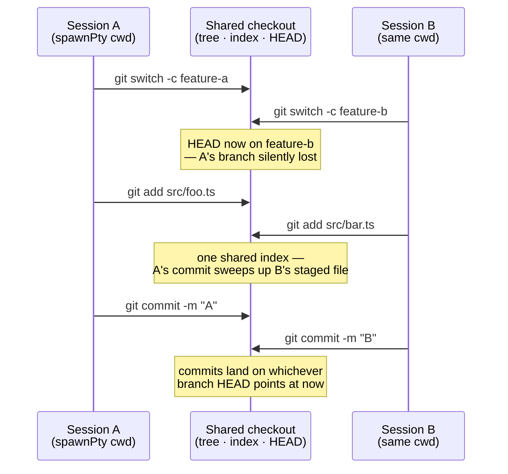
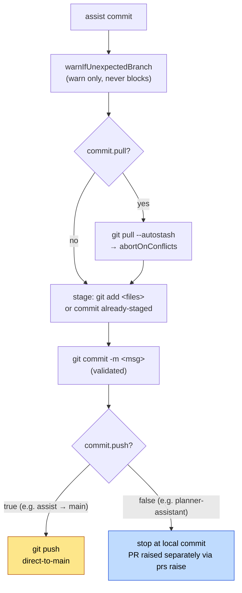
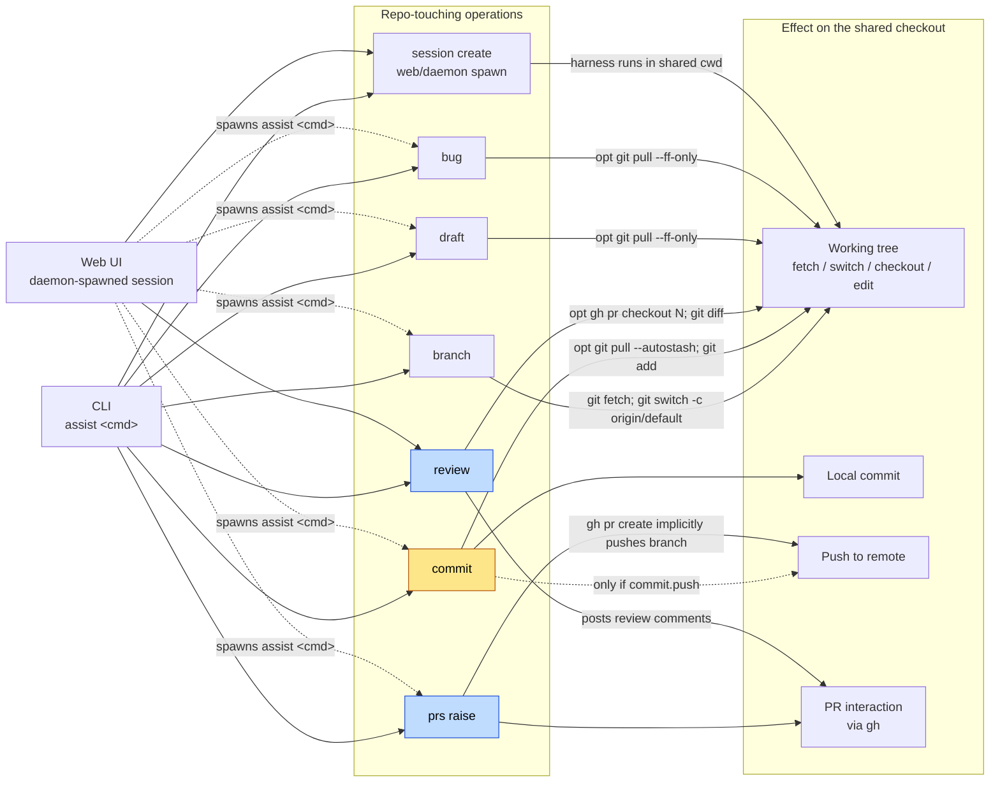
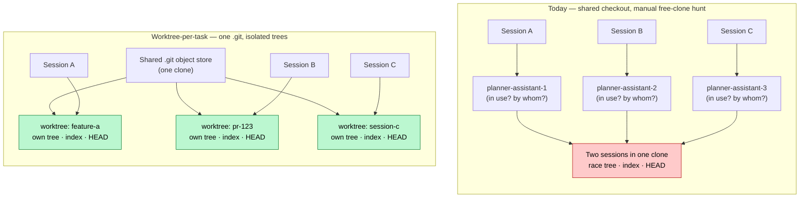
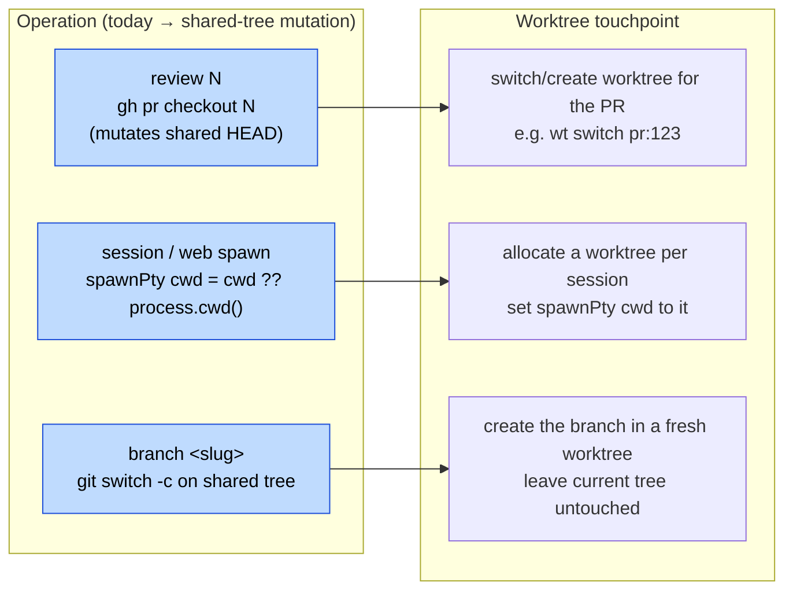

# How `assist` operates on a checked-out repository

`assist` runs many operations against a checked-out git repository — `branch`,
`commit`, PR raise, `review`, `draft`, `bug`, and interactive/web sessions —
invoked from both the CLI and the web UI. This document maps the current state
of every repo-touching operation: its invocation surface, what it does to the
working tree, and its commit/push/PR behaviour.

> **Scope of this document:** a current-state map — the shared-checkout model,
> per-operation inventory, config-driven commit/push behaviour, and flow
> diagrams — followed by an isolation analysis: where `git worktree` would
> remove cognitive load, the constraints that shape it, the candidate
> touchpoints, and the wrap-vs-native tradeoffs. It deliberately stops short of
> **deciding** wrap-`worktrunk` vs native `git worktree`, or proposing an
> implementation — that decision is left open.

## The shared single-checkout model

There is **no `git worktree` usage anywhere in the codebase**. Every CLI
command, daemon-spawned session, and web-launched harness runs directly against
a _single shared working tree_ selected by `cwd`:

- The daemon's `spawnPty` (`src/commands/sessions/daemon/spawnPty.ts`) spawns
  each harness with `cwd: cwd ?? process.cwd()` — the real repo directory,
  never a per-session copy.
- The web UI defaults a session's `cwd` to the web server's own working
  directory (`src/commands/sessions/web/handleSocket.ts:66-77`), so every
  web-launched session on a repo shares that one checkout.

Because of this, concurrent sessions genuinely race on the working tree. The
codebase already carries a comment about the fallout
(`src/commands/sessions/daemon/createSession.ts:32-34`, mirrored in
`src/commands/backlog/launchMode.ts:35-38` and `spawnClaude.ts`):

```ts
/* why: assign the claude conversation id up front so the card binds to the
 * transcript this process writes, not the newest unclaimed .jsonl in the cwd
 * (which races concurrent sessions in the same repo) (#413). */
```

That comment describes a _transcript-binding_ race (which `.jsonl` a session
card adopts), worked around by minting the conversation id up front — but the
same shared-checkout model means the git working tree, index, and current
branch are shared too, with no such workaround.

(The comment's "in the cwd" is shorthand: the transcript is not written to the
working directory itself but to a per-cwd project dir under
`~/.claude/projects/<encoded-cwd>/` — see `projectDirForCwd` in
`src/commands/sessions/shared/findTranscriptPathSync.ts`. It is keyed by `cwd`,
so concurrent sessions sharing a `cwd` still share that transcript dir, and the
poller race the comment guards against is real; only its location differs.)

The sequence below shows the unguarded case: two sessions the daemon spawned
into the _same_ `cwd` interleave git operations against one working tree, index,
and `HEAD`.



Nothing in the current model serialises or isolates these operations — the only
mitigation shipped is the transcript-id workaround, which does not touch git
state.

## Config that gates git behaviour

The only place config alters git behaviour is the `commit:` block (plus
`branch:`) in `assistConfigSchema` (`src/shared/types.ts:25-38`), read via
`loadConfig()`:

```ts
commit: z.strictObject({
	conventional: z.boolean().default(false),
	pull: z.boolean().default(false),
	push: z.boolean().default(false),
	expectedBranch: z.string().optional(),
});
```

| Key                                      | Effect                                                                                | Where                                    |
| ---------------------------------------- | ------------------------------------------------------------------------------------- | ---------------------------------------- |
| `commit.pull`                            | `git pull --autostash` before commit; `git pull --ff-only` at draft/bug/refine launch | `commit.ts:19-22`, `pullIfConfigured.ts` |
| `commit.push`                            | `git push` after committing                                                           | `commit.ts:27-30`                        |
| `commit.expectedBranch`                  | warns (does not block) if current branch differs                                      | `warnIfUnexpectedBranch.ts`              |
| `commit.conventional`                    | enforces conventional-commit message format                                           | `commit/validateMessage.ts`              |
| `branch.prefix` / `branch.defaultBranch` | branch-name prefix / default-branch override                                          | `branch/createBranch.ts:18-23`           |

This is what makes commit/push behaviour differ per repo: `assist` itself sets
`commit.push: true` with `expectedBranch: main` (pushes straight to `main`),
whereas a PR-based repo like planner-assistant leaves `push: false` and raises
PRs instead.

The `commit` path branches entirely on these config keys — the same
`assist commit` invocation resolves to _direct-to-`main`_ in one repo and
_local-commit-then-PR_ in another:



## Overview: operations → invocation surface → git behaviour



Yellow = commits/pushes directly to the current branch (direct-to-`main` when
that is the checked-out branch); blue = PR-based. `draft`, `bug`, and session
creation are _launchers_: they perform no commit/push themselves, but spawn a
harness that may run `assist commit` / `prs raise` inside the same shared
checkout.

## Operation inventory

Each operation below records its **invocation surface**, **working-tree
effects**, **commit/push behaviour**, and **PR-vs-direct-to-main**.

### `branch` — branch creation

- **Entry:** `registerBranch.ts` → `branch/createBranch.ts`.
- **Surface:** CLI (`assist branch <slug>`); web only indirectly via a spawned
  `assist` session.
- **Working tree:** `git fetch`, then
  `git switch -c <branch> origin/<defaultBranch>` (default resolved via
  `git ls-remote --symref origin HEAD`, overridable by `branch.defaultBranch`).
  No file edits, no staging.
- **Commit / push:** none.
- **PR vs direct:** neither — creates a local branch off the fresh remote
  default.

### `commit`

- **Entry:** `commit.ts` + `commit/`. Also driven by the `/commit` skill inside
  sessions.
- **Surface:** CLI (`assist commit`); reachable from web only via a spawned
  session.
- **Working tree:** if `commit.pull`, `git pull --autostash` first, then
  `abortOnConflicts()`; with explicit files, `git add <files>`; otherwise
  commits already-staged content. `assist commit status` runs read-only
  `git status && git diff`.
- **Commit:** `git commit -m <msg>` (message validated;
  `warnIfUnexpectedBranch` sanity-checks the branch).
- **Push:** `git push` **only if `commit.push`** is set.
- **PR vs direct:** direct — commits to the current branch and optionally
  pushes it. Direct-to-`main` in repos (like `assist`) whose checked-out branch
  is `main` with `push: true`.

### `prs raise` — PR raising

- **Entry:** `prs/raise.ts`, `registerPrsRaise.ts`. Also the `/pr` skill.
- **Surface:** CLI (`assist prs raise`); the web UI surfaces PR _state_ and can
  spawn a session, but raising itself is the `gh`-backed CLI action.
- **Working tree:** none — assembles a PR body from `--what/--why/--how` and
  validates it.
- **Commit:** none.
- **Push:** delegated to `gh pr create` (which implicitly pushes the current
  branch), or `gh pr edit <n>` when a PR already exists.
- **PR vs direct:** PR-based — this is the PR-raising path.

### `review` — PR review

- **Entry:** `registerReview.ts` → `review/review.ts` → `reviewPr()`. Also the
  `/review` skill and dedicated web review affordances (ReviewButton,
  ReviewSynthesisDialog, `getReviewSynthesis.ts`).
- **Surface:** CLI (`assist review [number]`) **and** web UI.
- **Working tree:** read-mostly. With a PR number, `gh pr checkout <number>`
  **mutates the working tree/branch**; otherwise operates on the current
  branch. Gathers context via `git rev-parse`, `git fetch origin <sha> <sha>`,
  `git diff <base>...<head>`, `gh pr diff/list`, `gh api .../files|comments`.
  Writes review artifacts to a cache dir, not the repo.
- **Commit:** none by default; `--apply` launches an interactive session that
  may edit/commit; `--backlog` files findings as a backlog item.
- **Push:** none — posts the synthesized review back to the PR via `gh`.
- **PR vs direct:** PR-based.

### `draft` — backlog item drafting

- **Entry:** `registerLaunch.ts` → `launchMode("draft", ...)`. Also the
  `/draft` skill.
- **Surface:** CLI (`assist draft` / `assist feat`) and web/daemon spawn.
- **Working tree:** `launchMode` does no direct edits; it calls
  `pullIfConfigured()` (`git pull --ff-only` only if `commit.pull` and the tree
  is clean) then spawns a Claude harness running `/draft <description>`. Actual
  changes are made by the session (usually writing backlog items).
- **Commit / push:** none directly; only whatever the launched session does.
- **PR vs direct:** n/a at this layer (a launcher).

### `bug` — bug filing

- **Entry:** `registerLaunch.ts` → `launchMode("bug", ...)`. Also the `/bug`
  skill.
- **Surface / behaviour:** identical mechanism to `draft` —
  `pullIfConfigured()` then spawn Claude with `/bug <description>`. The
  race comment at `launchMode.ts:35-38` explicitly names "concurrent draft/bug
  sessions in the same repo."

### Session creation — `createSession.ts`

- **Entry:** `daemon/createSession.ts` (`createSession`, `createRunSession`,
  `createPiSession`), invoked by `SessionManager.spawn()` via the daemon
  `create` message handler.
- **Surface:** daemon-internal; driven by both CLI-spawned and web-spawned
  sessions.
- **Working tree:** no git operations here — mints `claudeSessionId` up front
  (the #413 race workaround) and spawns `spawnClaude`/`spawnPi`/`spawnRun`,
  which `spawnPty` into the shared repo `cwd`. Any git work is done by the
  harness process.
- **Commit / push / PR:** none directly.

### Web/daemon session-spawn path

- **Entry:** web UI action creators (`web/ui/createSessionAction.ts`) send
  WebSocket messages (`create`, `create-run`, `create-assist`, `resume`, …) to
  the daemon dispatcher (`daemon/messageHandlers.ts`).
- **Surface:** both — the daemon serves CLI-spawned and web-UI-spawned sessions
  through the same handlers.
- **Working tree:** the web layer passes a `cwd` (the selected repo path) to the
  daemon, which `spawnPty`s the harness in that exact directory. No
  worktree/clone isolation — concurrent web-launched sessions on the same repo
  share one tree. `create-assist` is the generic path by which the web UI can
  run any `assist <cmd>` (including `commit`, `branch`, `prs raise`) inside the
  shared checkout.
- **Windows note:** windows-origin create/resume forwards to a Windows daemon
  (`forwardWindowsCreate.ts`), but the tree-sharing model is the same.

### `prompts` (not repo-touching)

Listed for completeness: `assist prompts` ("show top denied tool calls by
frequency", `registerPrompts.ts`) touches no git state — no working tree,
commit, push, or PR interaction.

## Summary table

| Operation        | Entry                                       | Working tree                  | Commits          | Pushes              | PR vs direct     | CLI / Web                   |
| ---------------- | ------------------------------------------- | ----------------------------- | ---------------- | ------------------- | ---------------- | --------------------------- |
| `branch`         | registerBranch.ts                           | `fetch` + `switch -c`         | no               | no                  | neither          | CLI (web via create-assist) |
| `commit`         | commit.ts                                   | `add`, opt `pull --autostash` | yes              | opt (`commit.push`) | direct-to-branch | CLI + `/commit`             |
| `prs raise`      | prs/raise.ts                                | none                          | no               | via `gh pr create`  | PR-based         | CLI + `/pr`; web shows PRs  |
| `review`         | review/review.ts                            | opt `gh pr checkout`, diffs   | only `--apply`   | posts via `gh`      | PR-based         | CLI + `/review` + web       |
| `draft`          | launchMode.ts                               | opt `pull --ff-only`          | no (session may) | no                  | launcher         | CLI + `/draft` + web        |
| `bug`            | launchMode.ts                               | opt `pull --ff-only`          | no (session may) | no                  | launcher         | CLI + `/bug` + web          |
| session create   | daemon/createSession.ts                     | spawns harness in shared cwd  | no               | no                  | n/a              | daemon (CLI + web)          |
| web/daemon spawn | createSessionAction.ts + messageHandlers.ts | spawns harness in shared cwd  | no               | no                  | n/a              | both                        |

## Isolation analysis: where `git worktree` would help

The current-state map above shows every repo-touching operation funnelling
through **one** working tree selected by `cwd`. This section overlays where a
worktree-per-task model would remove friction, the constraints that shape any
such change, the candidate touchpoints, and the open wrap-vs-native decision.

### Cognitive-load wins

The clearest win is eliminating the **"pick an unused checkout" problem**.
Today, running concurrent work on a PR-based repo means keeping several physical
clones side by side — e.g. `planner-assistant-1`, `-2`, `-3` — and _remembering
which one is free_ before starting a session, because two sessions in the same
clone race the shared tree/index/HEAD (see the sequence diagram above). That is
manual bookkeeping the tool imposes, not the task.

A worktree-per-task model replaces "find a free clone" with "make a worktree":



The race documented earlier is removed _structurally_: each session gets its own
tree, index, and `HEAD` while sharing one object store, so there is no free-clone
to hunt for and no interleaving of git state.

### Readiness signal

The session-status branch reader is **already worktree-layout compatible**.
`readGitBranch` (`src/commands/readGitBranch.ts`) resolves a `.git` _file_ whose
contents are a `gitdir: …` pointer — exactly the layout `git worktree` creates
for linked worktrees — and follows it to the real `HEAD`
(`readGitBranch.test.ts` covers the worktree case explicitly). So the blocker is
not that surrounding code assumes a single `.git` directory; it is that nothing
_creates_ worktrees and nothing points `spawnPty`'s `cwd` at one.

### Constraints

Three constraints shape any worktree adoption:

1. **Global install / `PATH`.** `assist` is a global binary — `package.json`
   maps `bin.assist` → `./dist/index.js`. Every running instance executes that
   _single globally-installed compiled build_ regardless of `cwd`. A worktree
   of the **assist source** therefore does **not** put its own compiled build on
   `PATH`. Consequence: worktree isolation benefits any _target_ repo
   immediately, but dogfooding worktree-based changes _to assist itself_ still
   runs the old global build until it is rebuilt/relinked. Worktrees isolate the
   working tree, not the running binary.
2. **The Windows-host checkout.** `isWindowsCwd` / `shouldProxyToWindows`
   (`daemon/isWindowsCwd.ts`): a WSL daemon proxies `C:\…` cwds to a _native
   Windows daemon_, which drives the checkout with its own PTY. Worktrees for a
   Windows repo must live on the Windows filesystem and be created/driven on the
   Windows side — the WSL daemon only forwards create/resume
   (`forwardWindowsCreate.ts`). Any worktree orchestration has to be aware of,
   and replicated across, the WSL↔Windows boundary; it cannot be a WSL-only
   step.
3. **Per-repo PR vs push-to-`main`.** Worktree isolation is orthogonal to the
   commit/push policy (the `commit:` block), so both repo styles keep their
   behaviour — but the _value_ differs. PR-based repos (e.g.
   planner-assistant, `push: false`) gain the most: many feature branches, each
   in its own tree, developed in parallel. Push-to-`main` repos (e.g. `assist`,
   `push: true`, `expectedBranch: main`) gain isolation for concurrent sessions
   but still serialise on the one shared `main` at push time — worktrees remove
   the working-tree race, not the shared-remote-branch contention.

### Candidate touchpoints

Where the shared-checkout mutation would become a per-worktree action:



- **`review N`** — `checkoutPr()` (`review/review.ts:37`) runs
  `gh pr checkout <number>`, which mutates the branch/tree of the one shared
  checkout. A worktree touchpoint (`wt switch pr:123`, or a native
  `git worktree add`) would review the PR in its own tree, leaving the session's
  current work untouched.
- **session / web spawn** — `spawnPty` (`daemon/spawnPty.ts:30`) uses
  `cwd ?? process.cwd()`. Allocating a worktree per session and pointing `cwd`
  at it is the single highest-leverage change: it isolates every daemon- and
  web-spawned session at once.
- **`branch <slug>`** — could create the branch in a fresh worktree instead of
  `git switch -c` on the shared tree.

### Wrap `worktrunk` vs native `git worktree` — tradeoffs (decision open)

This document does **not** decide between wrapping an existing tool
(`worktrunk`) and driving `git worktree` directly. The tradeoffs:

| Dimension                     | Wrap `worktrunk`                                                      | Native `git worktree`                                                   |
| ----------------------------- | --------------------------------------------------------------------- | ----------------------------------------------------------------------- |
| Implementation effort         | Lower — reuse its create/switch/list/prune and naming conventions     | Higher — assist owns add/list/prune, path layout, and lifecycle itself  |
| External dependency           | Adds a runtime dep that must be installed on every host               | None beyond `git`, already required                                     |
| Windows-host parity           | Only if `worktrunk` runs natively on the Windows side too             | `git` is already present on both sides; parity is assist's to implement |
| Control over layout/lifecycle | Constrained to `worktrunk`'s model and naming                         | Full control (dir layout, per-session naming, cleanup on session end)   |
| Surface area to maintain      | Smaller assist codebase; behaviour tracks an upstream tool            | Larger assist codebase; no upstream drift                               |
| Ergonomics                    | Ready-made UX (`wt switch pr:123`) that matches the touchpoints above | Must be designed; can be tailored exactly to assist's session model     |

Both are compatible with the constraints above (global-install binary isolation,
the WSL↔Windows boundary, and per-repo PR/push policy). The choice — and any
implementation — is intentionally left for a follow-up.
