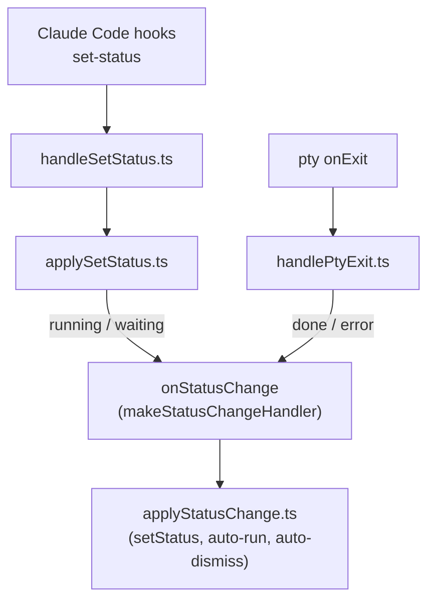

# Session pty lifecycle

> **Purpose:** map the full life of a session's pseudo-terminal (pty) against the
> real daemon symbols in `src/commands/sessions/daemon/` — spawn, event wiring,
> exit, restart/resume, and dismiss — and pin down the two rules that keep
> restart working: **status is never inferred from pty output**, and **restart
> must not wait on an `onExit` for a pty that is already dead**.

Every symbol named below is a file in `src/commands/sessions/daemon/`.

## The `session.pty` reference

A session (`createSession.ts` → the `Session` type in `types.ts`) holds a single
`pty` reference to its live `node-pty` process. Its lifecycle is:

- **Set at spawn** — `createSession` / `createRunSession` assign `pty` from
  `spawnClaude` / `spawnPi` / `spawnRun` (all funnel through `spawnPty.ts`).
  `respawnSession.ts` re-assigns it on restart.
- **Cleared on exit** — `handlePtyExit.ts` sets `session.pty = null` once the
  process is gone (and it is not a restart hand-off). This is the fix that makes
  restart work: an errored or done session no longer holds a reference to a dead
  pty, so `restartSession` can tell "process alive" from "process gone".

The invariant: **`session.pty` is non-null only while a real process is
running.** A session in `error` or `done` has `pty === null`.

## Spawn

```
createSession.ts / createRunSession   → spawnClaude.ts / spawnPi.ts / spawnRun.ts
                                       → spawnPty.ts (node-pty spawn)
                                       → wirePtyEvents.ts
```

`spawnPty.ts` is the single chokepoint that builds the login shell, strips
`CLAUDE_CODE_CHILD_SESSION`, and stamps `ASSIST_SESSION*` env. The initial
status comes from `createSession`: a prompted session starts `running`; a
prompt-less session starts `waiting` (idle, awaiting the user's first input —
no Claude Code hook fires until they submit).

## Event wiring — `wirePtyEvents.ts`

Only two events are wired, and the split is deliberate:

- **`onData`** appends to `session.scrollback` (bounded to `MAX_SCROLLBACK`) and
  broadcasts an `output` frame. It **never touches status.** Inferring status
  from output is wrong: a redrawing idle prompt (spinner / status line) is
  indistinguishable from active work by output alone, and inferring once flipped
  an awaiting-input card to `running` (#449).
- **`onExit`** calls `handlePtyExit`.

## Exit — `handlePtyExit.ts`

Runs in this order:

1. **`pendingRestart` short-circuit.** If a restart is pending, capture and clear
   it, then call it (`resume()`) and return — this is the kill-then-respawn
   hand-off (see below). Note `session.pty` is left as-is here because
   `respawnSession` is about to overwrite it.
2. **`session.pty = null`.** The process is gone; drop the reference.
3. **`handleStoppedExit.ts`** — an exit that follows an explicit stop request
   marks `done` and returns.
4. **`handleFailedResume.ts`** — a restored session that died before producing
   any output marks `error` and returns.
5. **Exit code.** Non-zero → `error` (`session.error` records the code). Zero →
   `done` (a zero exit from `waiting` is logged as an unexpected mid-session
   death but still marks `done`).

## Status derivation

Status has exactly two sources, and both route through **one handler**:

- **`running` / `waiting` are pushed by Claude Code hooks** via `set-status`
  (`handleSetStatus.ts` → `SessionManager.setStatus` → `applySetStatus.ts`).
  They are never inferred from pty output.
- **`done` / `error` come from pty exit** (`handlePtyExit.ts`, above).

Both paths call `onStatusChange`, which is `makeStatusChangeHandler.ts`'s closure
over `applyStatusChange.ts`. `applyStatusChange` is the single funnel: it skips
no-op changes (hooks re-assert `running` on every tool call), folds running time
into `runningMs` via `setStatus.ts`, and runs auto-run / auto-dismiss. Routing
every status change through here is what keeps the card timer and broadcasts
consistent regardless of which source fired.



## Restart / resume — `restartSession.ts`

```
respawnPlan.ts  → how to respawn (resume vs fresh) + resulting status
respawnSession.ts → clear scrollback/timers, set status, respawn pty, re-wire events
```

`respawnPlan` decides _how_ to come back: a claude session with a
`claudeSessionId` resumes (`spawnClaude --resume …`, status `waiting`); with no
id but an initial prompt it starts fresh (`running`); an `assist` session
resumes via `assistResumeArgs`. `null` means the session can't be restarted.

`restartSession` then chooses _whether to kill first_:

```ts
const pty = session.pty;
const alive = session.status === "running" || session.status === "waiting";
if (pty && alive) {
	session.pendingRestart = respawn; // hand off to handlePtyExit
	killPtyTree(pty); // real process — a real onExit will fire
} else {
	respawn(); // pty already dead — resume directly
}
```

**Why the guard keys on `alive`, not just `pty`.** The bug this documents (a744)
was that the guard was `pty && status !== "done"`. For an `error` session `pty`
was truthy (never cleared) and status wasn't `done`, so it took the
kill-and-wait branch, set `pendingRestart`, and killed an **already-dead
process**. No new `onExit` ever fires for a dead process, so
`handlePtyExit` never ran the `pendingRestart` callback and the restart stalled
silently — the card stayed `error`.

The fix is two-part and both parts are required:

1. `handlePtyExit` clears `session.pty = null` on exit, so a dead session no
   longer carries a stale pty reference.
2. `restartSession` gates the kill branch on `alive` (`running` / `waiting`),
   the only states with a genuinely live process. `done` and `error` both fall
   through to the direct `respawn()` — the same working path — so neither waits
   on an `onExit` that will never come.

The kill-first branch is still correct for a live session: `killPtyTree` sends
`SIGHUP` to the process group (or `pty.kill()` on Windows), a real `onExit`
fires, and `handlePtyExit`'s `pendingRestart` short-circuit resumes once the
process is actually gone.

## Dismiss / drain — `dismissSession.ts`

`dismissSession` tears a session down and removes it from the map. It kills the
pty only if the session isn't already `done` (`s.pty?.kill()` — the `?.` also
safely no-ops now that `pty` is `null` for `error`/`done`), closes the activity
and transcript watchers, removes activity, releases any backlog lock, and
deletes the session. `drainSessions` dismisses every session in turn. Both log
via `daemonLog` per the daemon logging rule.
