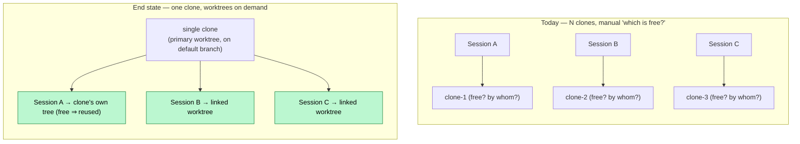
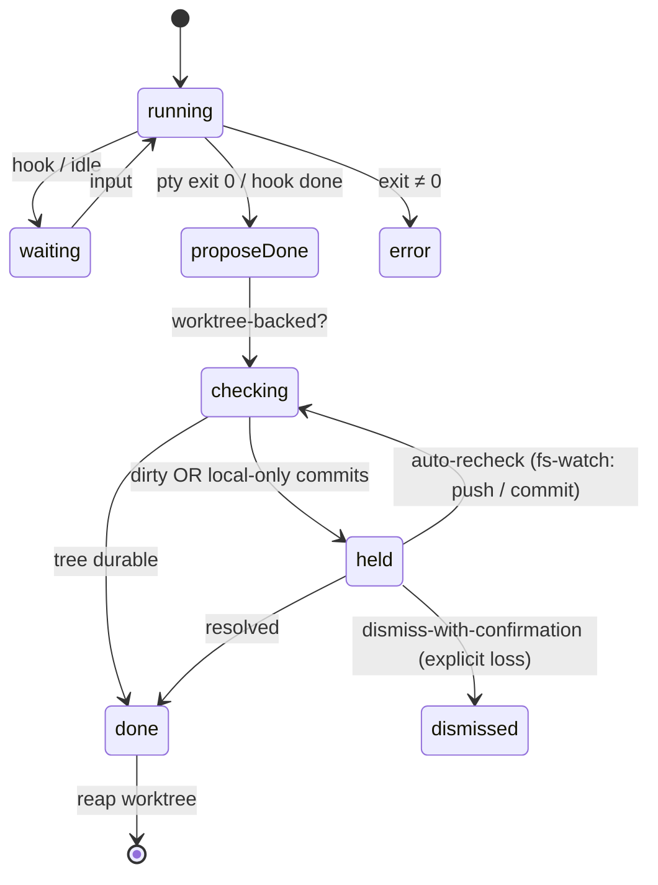
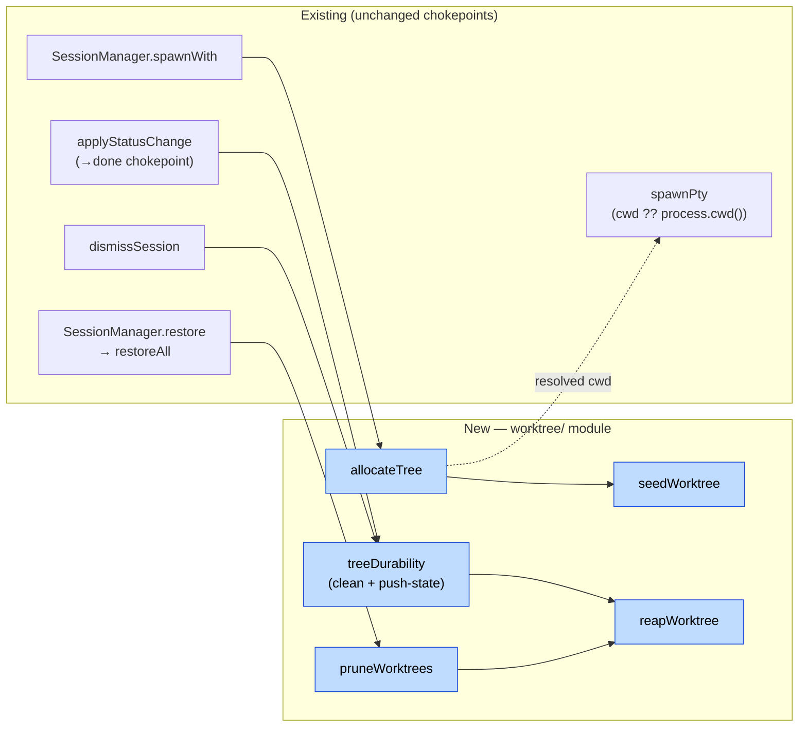

# Design: native `git worktree` isolation for concurrent sessions

> **Status:** design proposal, not yet approved. This builds directly on the
> current-state map in [`repo-operations.md`](./repo-operations.md), which
> established that there is **no `git worktree` usage anywhere** and every
> session shares one checkout selected by `cwd`. Read that first; this doc only
> covers the _change_.
>
> **Purpose of this doc:** answer the three questions that must be settled
> before writing any code — (1) what exactly are we building, (2) _where in
> assist does each piece go_ (against real files/symbols), and (3) _how do we
> know it is robust_ (stated as invariants, their enforcement point, and their
> test). It deliberately surfaces the decisions that are still open rather than
> hiding them.

## The end state

One clone per repo. Concurrency is handled by **linked worktrees hanging off
that single clone**, not by keeping multiple physical clones and remembering
which is free.

- A session **reuses the clone's own working tree when it is free**. Git's
  primary checkout is itself a worktree; there is no reason to force the first
  session into a linked one.
- Only a **concurrent** session — one that arrives while the clone's tree is
  already bound to a live session — spills into a linked worktree.
- A linked worktree is **seeded** with the gitignored files a session needs to
  build and run (`node_modules`, `.env`, `settings.local.json`, …).
- A worktree is **torn down only when its session reaches `done`**, and a
  session **cannot reach `done` while its tree holds undurable work** (dirty
  tree or local-only commits). No commit is ever stranded by teardown.
- The whole behaviour is **opt-in per repo, default off**. Until a repo enables
  it, the code path is byte-for-byte today's, so existing multi-clone workflows
  keep working; once enabled, the spare clones can be retired.



## Where each piece goes

Everything below names the real symbol/file it attaches to. The point of this
section is that **the seams already exist** — this is injection at established
chokepoints, not a rewrite.

### 1. Allocation — at `SessionManager.spawnWith`

Every session-creating path (`spawn`, `spawnAssist`, `spawnRun`, `resume`)
funnels through the private `spawnWith` in
`src/commands/sessions/daemon/SessionManager.ts`, which is also where the live
`this.sessions` map lives. That map is the authority on _which trees are
currently bound_. Allocation therefore slots in as a step that runs **before**
`createSession` (which is what forwards `cwd` into `spawnPty`).

New module: `src/commands/sessions/daemon/worktree/allocateTree.ts`

```
allocateTree(repoRoot, boundTrees) -> { cwd, kind: "primary" | "worktree", branch? }
```

- `repoRoot` — resolved from the requested `cwd` via the existing
  `findRepoRoot` (already used by `review/review.ts`).
- `boundTrees` — the set of tree paths currently bound to a live session,
  derived from `[...this.sessions.values()].map(s => s.cwd)`.
- If the clone's primary tree ∉ `boundTrees` → return it (today's behaviour).
- Else → `git worktree add <clone>-<n> -b <branch>` at the next free adjacent
  suffix and return that path.

The resolved `cwd` is then handed to `createSession` exactly as a caller-passed
`cwd` is today; `spawnPty` (`daemon/spawnPty.ts`) needs **no change** — it
already does `cwd: cwd ?? process.cwd()`.

**Why this is race-free within a host:** the daemon is a single Node process
and `spawnWith` is synchronous, so the read of `boundTrees` and the decision to
claim the primary tree happen atomically on the event loop. Two near-simultaneous
spawns cannot both claim the primary tree — the second observes the first's
session already in the map. (Cross-host WSL↔Windows is _different clones on
different filesystems_, so there is no shared tree to race; see §Windows.)

**Worktree path layout — adjacent siblings, never nested.** A worktree is
created _beside_ the clone at the next free numeric suffix: `<clone>` →
`<clone>-2` → `<clone>-3` (matching the `-1/-2/-3` naming the current
multi-clone workflow already uses). The allocator checks the path is free
before `git worktree add` and picks the next suffix on collision — so no
clobbering a real clone.

Nesting under the clone (`<clone>/.worktrees/…`) is **explicitly rejected**: a
coding harness recurses the working tree and would read/edit sibling worktrees
it must never touch. Keeping worktrees outside the clone's tree removes that
hazard structurally.

Adjacency has no filesystem-discovery cost: assist never scans `~/git` for
repos. The repo list is **session-derived** — `discoverSessions`
(`sessions/shared/discoverSessions.ts`) reads transcript dirs under
`~/.claude/projects/<encoded-cwd>/`, and `uniqueRepos.ts` / `groupSessionsByRepo.ts`
build the selector and session groups from those session `cwd`s. So a
`<clone>-N` sibling is invisible until a session actually runs in it. The one
real cost: once a session has run there, that worktree shows up as its **own
`cwd` entry/group**, because both helpers dedupe by `cwd` string. Collapsing
those back into a single logical repo is exactly what **Slice 2
(group-by-remote)** does — a clone and its `<clone>-N` worktrees share one
origin remote. Adjacency is safe _because_ Slice 2 groups by remote, not by
path.

### 2. Seeding — `worktree/seedWorktree.ts`

`git worktree add` populates **tracked files only**; every gitignored artifact
is absent, so a fresh worktree cannot build or run. Seeding runs immediately
after `git worktree add`, before the harness spawns. It has two distinct kinds
of thing to provision, handled by two distinct mechanisms:

**Dependencies (`node_modules`, …) — never shared, always per-worktree.**
Symlinking a shared `node_modules` from the primary clone is **rejected**: two
worktrees on branches with divergent `package.json`/lockfiles corrupt each other
through the shared tree, and two concurrent installs race and destroy it — which
defeats the isolation the whole feature exists to provide. So each worktree gets
its **own** `node_modules`:

- **pnpm** — a real `pnpm install` in the worktree is both isolated _and_ cheap:
  pnpm's global content-addressable store means the worktree's `node_modules` is
  hardlinks into that store, near-zero extra disk and fast. This is _not_ a
  dependency assist imposes; it only applies when the repo already uses pnpm.
- **npm / yarn** — a real per-worktree install. Correct and isolated, but pays
  full disk + time, since there is no shared store. (A future optimisation:
  `cp --reflink` copy-on-write from the primary `node_modules` on filesystems
  that support it — isolated at near-zero cost — but that is platform-dependent
  and out of scope for the first slice.)

Concretely: seeding runs the repo's configured install command (auto-detected
from the lockfile) in the new worktree. Correctness is by construction — no tree
is ever shared — and only the _speed_ varies by package manager.

**Config/secret files (`.env`, `settings.local.json`, …) — copied.** These are
small, per-developer, and a session may mutate them independently, so they are
**copied** (not symlinked, or a session editing `.env` would rewrite the
primary clone's). The file list is config, not hardcoded — see §Config.

### 3. The `→ done` durability gate — at `applyStatusChange`

`applyStatusChange` (`daemon/applyStatusChange.ts`) is the **single chokepoint
for every status transition** — `handlePtyExit`, hook-driven `set-status`, and
run-reuse all pass through it via `makeStatusChangeHandler`. Its first line is
`if (session.status === status) return;`. The durability gate attaches here, and
only for worktree-backed sessions on worktree-enabled repos.

The invariant (per the directive that drove this design): **a session cannot
reach `done` while its tree is dirty or holds local-only commits.** Durability
is defined as:

```
tree clean (git status --porcelain empty)
  AND (commit.push  OR  branch not ahead of its upstream)
```

Note `commit.push` means "push the current branch on every commit" — so a
`push:true` repo's commits are already on the remote and the branch is never
ahead; a `push:false` repo's commits sit local-only until a PR/manual push, and
_that_ is the case the gate must catch.



**The hard part — the gate is async, the pipeline is sync.** `applyStatusChange`
is synchronous and fires from a sync `pty.onExit`. The durability check shells
out to git (async). So a proposed `done` cannot be resolved inline. The design:

1. On a proposed `→ done` for a worktree session, **do not set `done`
   synchronously.** Hold the session in an interim state and kick off the async
   durability check.
2. When the check resolves _durable_ → apply `done` (→ triggers reap).
3. When it resolves _undurable_ → keep the session held, with a
   human-readable reason on the card, and expose recovery affordances.

**Open decision (flagged, not silently chosen):** how to represent "held".
`SessionStatus` is a closed union `running | waiting | done | error`
(`daemon/types.ts`), threaded through the persisted schema, the web UI, and
`shouldAutoDismiss`/`shouldAutoRun`. Two options:

| Option                                               | What                                                                                                                                    | Cost                                                                                                                           |
| ---------------------------------------------------- | --------------------------------------------------------------------------------------------------------------------------------------- | ------------------------------------------------------------------------------------------------------------------------------ |
| **Reuse `waiting` + `undurable` flag** (recommended) | Session stays `waiting` with `session.undurable = { reason }`; UI renders a distinct chip; `done` is simply never applied until durable | No union widening, no schema/UI migration; the only new surface is one flag + one chip                                         |
| **Add a 5th status `held`**                          | First-class state                                                                                                                       | Touches the union, persisted schema, every `switch` on status, UI status rendering, auto-dismiss/auto-run — broad blast radius |

Recommended: reuse `waiting`. The card is honest ("waiting — unpushed commits")
and the change stays local.

**Recovery, so the user is never trapped:** a held session exposes
(a) _auto-recheck_ — the daemon **fs-watches the held worktree's git state**
(HEAD/refs/index — the session already carries `activityWatcher`/`transcriptWatcher`
FSWatchers, so this is the same mechanism) and **re-runs the durability gate on
change**; the moment the branch becomes durable (pushed / commits gone), it
transitions held→done and reaps automatically, no user action required;
(b) _open a session in this worktree_ to resolve it; and
(c) _dismiss anyway_ (explicit, confirmed data-loss acceptance). Without (c) a
genuinely abandoned branch could pin a worktree forever; with it, loss is only
ever an explicit user choice.

### 4. Teardown / reap — `worktree/reapWorktree.ts`

Two entry points, both already exist:

- **Clean `→ done`** in `applyStatusChange` → reap.
- **`dismissSession`** (`daemon/dismissSession.ts`) — the explicit user close.
  Today it does `if (s.status !== "done") s.pty?.kill()`. This is the escape
  hatch that could strand commits, so it must route through the **same
  durability gate**: a dismiss of an undurable worktree session requires the
  confirmed data-loss path, never a silent `git worktree remove`.

Reap = `git worktree remove` (never `--force` on an undurable tree; the gate
guarantees durability before we get here) and drop the tree→session binding.

### 5. Orphan pruning — at `SessionManager.restore` / startup

`restore()` calls `restoreAll(this.spawnWith, this.sessions)`, which reads
`sessions.json` via `loadPersistedSessions`. Persistence (`persistLiveSessions`)
already saves each non-done session's `cwd` — so a worktree path _is_ the
persisted tree→session binding, and `restoreOne` re-spawns straight back into
that worktree. The binding survives a daemon restart for free, **as long as the
worktree still exists.**

The gap: worktrees whose session died while the daemon was down (SIGKILL,
crash, host reboot) — no live/persisted session points at them. A startup
reconcile closes it:

New module: `worktree/pruneWorktrees.ts`, called from `restore()`.

```
for each repo with worktree mode on:
  actual   = git worktree list --porcelain
  accounted = persisted session cwds ∪ live session cwds
  for each actual worktree not in accounted:
     if durable → git worktree remove   (safe reclaim)
     else       → leave + surface (never auto-destroy undurable work)
```

`git worktree prune` alone is insufficient: it only fixes git's _administrative_
bookkeeping for already-deleted dirs; it neither applies the durability gate nor
removes live-but-orphaned trees. Hence the explicit reconcile.

### 5a. Conversation transcripts & the History tab

Claude Code writes each session's transcript to a directory keyed **by cwd** —
`projectDirForCwd` (`sessions/shared/findTranscriptPathSync.ts`) is
`~/.claude/projects/<cwd with every non-alnum → '-'>/`. A worktree has its own
cwd, so **a worktree session's transcript lands in its own project dir**
(`~/.claude/projects/<encoded <clone>-N>/<claudeSessionId>.jsonl`). Two
consequences:

- **Transcripts survive reap.** They live under `~/.claude`, not inside the
  worktree, so `git worktree remove` leaves them intact. Cleaning up a worktree
  never loses its conversation history. (The historical cwd is also stored
  _inside_ the transcript — `parseSessionFile` reads `meta.cwd`, line 37 — so
  history can be reconstructed without the dir existing.)
- **The History tab would sprawl.** `discoverSessions` walks every
  `~/.claude/projects/*` dir, and `uniqueRepos` / `groupSessionsByRepo` bucket by
  cwd — so each `<clone>-N` worktree becomes its own history entry. This is the
  _same_ disease as the live-selector sprawl, cured the same way: **group-by-remote
  (Slice 2) must cover the History tab, not just live sessions.**

Grouping a _reaped_ worktree's sessions is the one hard case: the dir is gone,
so we cannot `git` its origin on demand. Two supports handle it:

- The transcript already carries `meta.cwd`, so the session's worktree path is
  known.
- A small persisted **worktree registry** (`~/.assist/worktrees.json`: worktree
  path → clone path + normalized origin, written at allocate, retained after
  reap) maps that path to its clone's remote. History grouping reads the origin
  from the registry instead of shelling into a deleted path. (Stripping the
  `-N` suffix to guess the clone is rejected — it misfires on a real repo named
  literally `foo-2`.)

**Known cosmetic wart:** because worktree suffixes are reused, a reaped
`<clone>-2` and a later unrelated `<clone>-2` share one project dir. Under
remote-grouped history that is one bucket anyway, and each session remains a
distinct `.jsonl` keyed by its own `claudeSessionId`, so nothing merges — the
two tasks simply sort together under the repo. Documented, not fixed.

### 6. Config — `assistConfigSchema` in `src/shared/types.ts`

A new opt-in block, read via `loadConfig()`, surfaced in `--help` via
`configHelp` (per the repo's `verify:config-keys` check):

```ts
worktree: z.strictObject({
	enabled: z.boolean().default(false),
	root: z.string().optional(), // default: clone's parent dir (siblings <clone>-N)
	install: z.union([z.boolean(), z.string()]).default(true), // per-worktree dep install; auto-detect pm, or an explicit command
	copy: z
		.array(z.string())
		.default([".env", "settings.local.json", ".claude/settings.local.json"]),
}).optional();
```

`enabled: false` (default and absent) ⇒ `allocateTree` always returns the
primary tree ⇒ **identical to today**.

**Hard dependency — per-repo config from the global level (separate item).**
This block has to be settable _per repo_ on repos where assist has **no
committed `assist.yml`**. Today `loadConfig()` merges only two tiers —
`~/.assist.yml` (global, applied flat to _every_ repo) `⊕` the project
`assist.yml` — so neither tier can say "worktrees on for _this_ repo only,
without committing anything to it." The missing capability is a **third tier:
per-repo overrides stored in the global file, keyed by repo identity**:

```
global-flat  ⊕  global-per-repo[identity]  ⊕  project
```

The identity key is the **normalised origin remote** — the same primitive
Slice 2 builds to dedupe the selector, so the two share one repo-identity
function. This is broader than worktrees (any per-repo knob benefits) and is
tracked as its **own backlog item**; worktree Slice 1 cannot enable
uncommitted repos until it lands.

### 7. Windows boundary — behind the existing proxy seam

For `C:\…` repos the WSL daemon forwards create/resume to a native Windows
daemon (`isWindowsCwd`, `forwardWindowsCreate`, `WindowsProxy`). Worktrees for a
Windows repo must live on the Windows filesystem and be created/removed/listed
by the Windows-side daemon. **All worktree operations therefore sit behind the
same routing that already exists** — `allocateTree`, `seedWorktree`,
`reapWorktree`, and `pruneWorktrees` run wherever the session's daemon runs.
There is no new cross-boundary protocol; there is a requirement that the
worktree code is invoked on the correct side, which the current
create/resume routing already determines.

## Component map



## How we know it is robust

Robustness is stated as **invariants**, each with the single place it is
enforced and the way it is tested. If an invariant has no enforcement point in
real code, it is not a claim — it is a wish; every row below names one.

| #      | Invariant                                                                       | Enforced at                                                                                  | Test                                                                                                                 |
| ------ | ------------------------------------------------------------------------------- | -------------------------------------------------------------------------------------------- | -------------------------------------------------------------------------------------------------------------------- |
| **I1** | A worktree is never removed while its tree is dirty or holds local-only commits | `treeDurability` gate guards both `reapWorktree` call sites (done + dismiss + prune)         | Unit-test `treeDurability` as a pure function over `git status`/`rev-list` outputs incl. `push:true` vs `push:false` |
| **I2** | A session cannot reach `done` while its tree holds undurable work               | `applyStatusChange` holds `→done` pending the async check                                    | Unit-test the transition: proposed-done + undurable ⇒ stays `waiting` w/ reason; durable ⇒ `done`                    |
| **I3** | The clone's primary tree is reused when free; each tree binds ≤1 live session   | `allocateTree` reads `boundTrees` from the live map; synchronous in a single-threaded daemon | Unit-test `allocateTree`: empty bound-set ⇒ primary; primary bound ⇒ worktree                                        |
| **I4** | A daemon restart strands no worktree unaccounted-for                            | `pruneWorktrees` reconciles `git worktree list` against persisted+live cwds on `restore()`   | Unit-test reconcile over fixture worktree-list + session sets                                                        |
| **I5** | With worktree mode off, behaviour is byte-for-byte today's                      | `allocateTree` returns primary tree when `worktree.enabled` is false/absent                  | Unit-test the disabled branch; existing session tests unchanged                                                      |
| **I6** | Loss of committed work is only ever an explicit, confirmed user action          | dismiss-with-confirmation is the _only_ path that removes an undurable tree                  | Unit-test dismiss on undurable session requires the confirm flag                                                     |

The design is deliberately shaped so the **risky logic is pure and unit-testable
in isolation** — `treeDurability`, `allocateTree`, and the prune reconcile take
data in and return decisions out, with no daemon or PTY needed. The parts that
_cannot_ be unit-tested (real PTY + real git + daemon lifecycle interleaving)
are covered by one scripted manual check, not hand-waving.

### Failure modes considered

| Failure                                         | Behaviour                                                                                                                                                                                                                              |
| ----------------------------------------------- | -------------------------------------------------------------------------------------------------------------------------------------------------------------------------------------------------------------------------------------- |
| Harness SIGKILL / crash mid-session             | pty exit ≠ 0 → `error` (existing), worktree left intact; reclaimed by `pruneWorktrees` on next restart _iff durable_, else surfaced                                                                                                    |
| Daemon crash with live worktrees                | worktrees persist on disk; `restore()` re-binds those with persisted sessions; `pruneWorktrees` handles the rest                                                                                                                       |
| `git worktree add` fails (disk, lock)           | `allocateTree` surfaces the error; spawn fails loudly rather than silently falling back to the shared tree (which would reintroduce the race)                                                                                          |
| Dependency install fails (network, toolchain)   | session still spawns; missing deps surface as the app's own build error, not a silent half-state; the install runs in the worktree's _own_ `node_modules`, so a failure never touches the primary clone; errors logged to `daemon.log` |
| User never pushes an abandoned branch           | worktree held indefinitely (I2), visible on the card; reclaimed only via explicit dismiss-with-confirmation (I6)                                                                                                                       |
| Two concurrent spawns race for the primary tree | impossible within a host — synchronous claim on the single-threaded event loop (I3)                                                                                                                                                    |

### Open questions that must be answered before build

1. **Held-state representation** — ~~open~~ **DECIDED: reuse `waiting` +
   `undurable` flag.** The choice is settled by counting readers of
   `session.status` that must distinguish held from waiting: it is ~5 spots,
   mostly must-change-either-way. A 5th `held` status would pay the full
   union-widening cost (the second `SessionStatus` in `web/ui/types.ts`, the
   persisted `z.enum`, `deriveRestoreStatus`, `toSessionInfo`) but earns nothing
   back — the code uses scattered `status === "done"` comparisons, not exhaustive
   `switch`es, so adding a union member produces zero compile errors at the
   ~14 don't-care sites (no enforced-exhaustiveness payoff). A's one weakness —
   a silently missed guard — is removed by keeping the durability check at the
   single `done`-writing chokepoint (`applyStatusChange`) and never setting
   `done` while undurable: since auto-dismiss and auto-run both gate on
   `status === "done"`, the destructive paths can never fire on a held session,
   so the flag only needs reading in the few spots that present it (UI chip,
   persist filter) or could flip it off (`reconcileTranscriptStatus`,
   `watchPromptSubmit`).
2. **npm/yarn install cost** — a per-worktree install is correct but pays full
   disk + time without pnpm's store. **The `cp --reflink` CoW path is ruled out
   for this environment:** the WSL repos live on **ext4** (`/dev/sdd`; a
   `cp --reflink=always` probe returns _Operation not supported_) and the Windows
   host is **NTFS** on `C:` (via a 9p mount) — neither supports reflinks, so
   `--reflink=auto` would always fall back to a full copy. Reflink would only
   ever help on a btrfs/XFS disk or a Windows Dev Drive (ReFS). So the realistic
   choice is **pnpm** (its store uses **hardlinks**, which _do_ work on ext4/NTFS
   → isolated _and_ cheap) where the repo uses it, else a **plain per-worktree
   install**. (Sharing `node_modules` remains off the table — it corrupts across
   divergent branches and concurrent installs.)
3. **Recheck trigger** — ~~open~~ **DECIDED: auto-watch.** The daemon fs-watches
   the held worktree's git state and re-runs the durability gate on change,
   auto-transitioning held→done→reap when the branch becomes durable — no manual
   recheck. Reuses the existing per-session FSWatcher mechanism (§3).
4. **First rollout repo** — **deferred; decide at build time.** (Note the
   global-install caveat from `repo-operations.md`: isolating worktrees of
   _assist itself_ still runs the old global build until relinked — a reason not
   to pick assist as the first dogfood target.)

## Rollout as vertical slices

Each slice leaves the tool strictly better off and passes `assist verify`
standalone (every export wired to a caller in the same slice):

- **Slice 1 — worktree spill + lifecycle:** §1 allocate (incl. writing the §5a
  worktree registry), §2 seed, §3 gate, §4 reap, §5 prune, §6 config. The whole
  safety story ships together because the invariants are interdependent — a gate
  with no reaper, or a reaper with no gate, is not shippable. Manual check: two
  concurrent sessions on an enabled repo → second in a worktree, both build/run;
  a local-only commit blocks `done` until pushed; worktree reaped on `done`.
- **Slice 2 — group by remote (live selector _and_ History tab):** each worktree
  has its own `cwd`, and both the live selector and history dedupe by `cwd`
  (`uniqueRepos.ts`, `groupSessionsByRepo.ts` over `discoverSessions`), so
  worktree sessions sprawl into separate entries. Bucket by normalised origin
  instead — resolved live via git for existing trees, and via the §5a registry
  for reaped worktrees whose dir is gone — so a clone and all its `<clone>-N`
  worktrees read as one entry in _both_ views.
- **Slice 3 — route `review` through the allocator:** `checkoutPr`
  (`review/review.ts`) runs `gh pr checkout N` against the shared tree today.
  Route it (and review-pr-comments' apply/commit) through `allocateTree` so a PR
  checkout lands in its own tree and never clobbers in-progress work.

```

```
