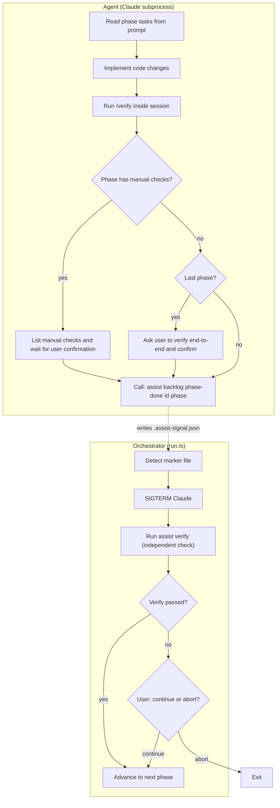
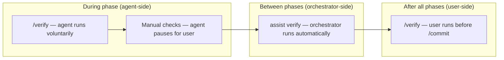
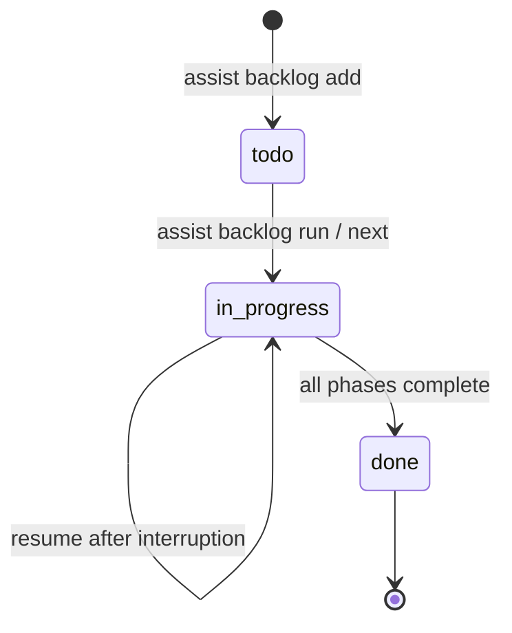
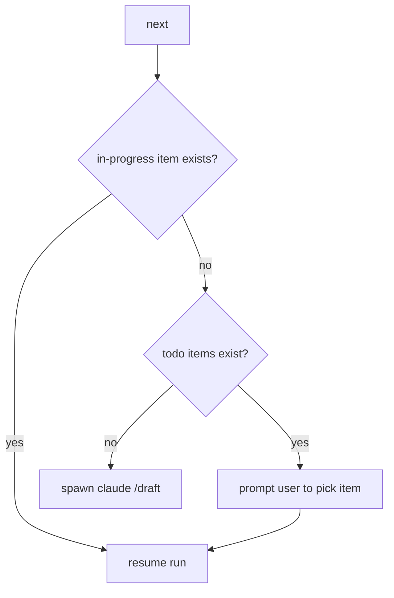
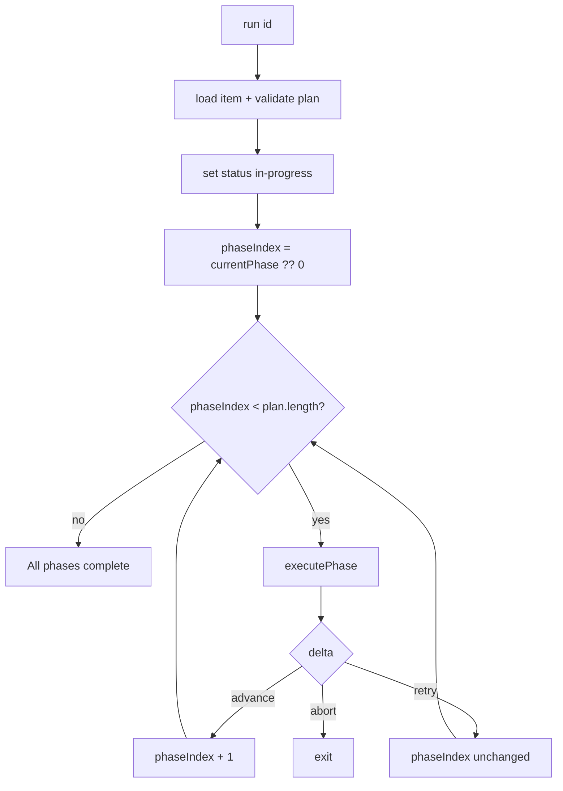
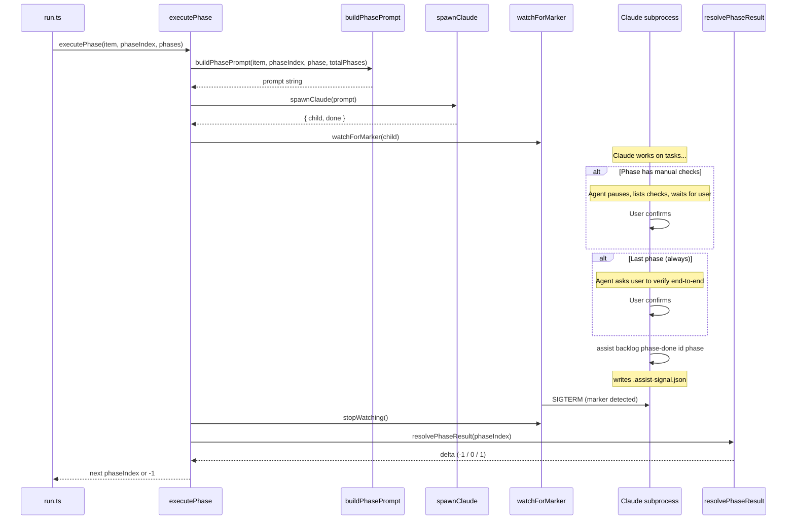
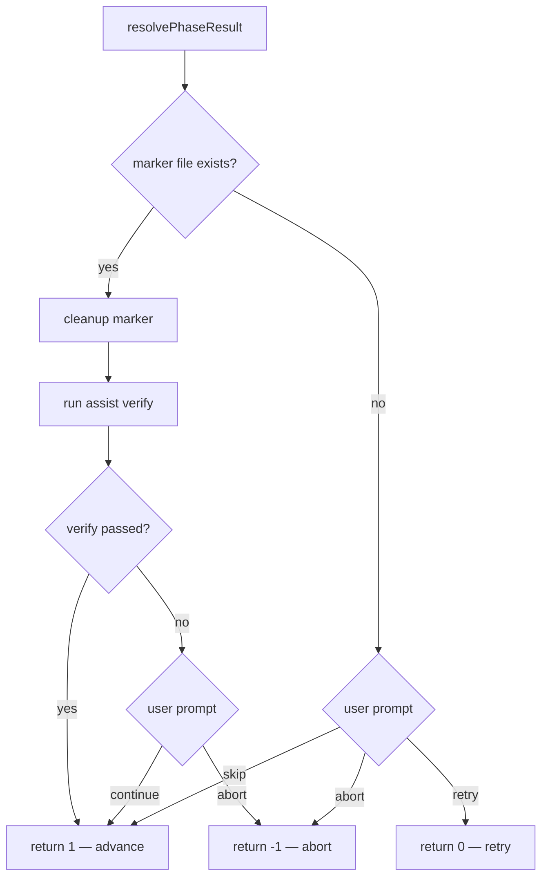
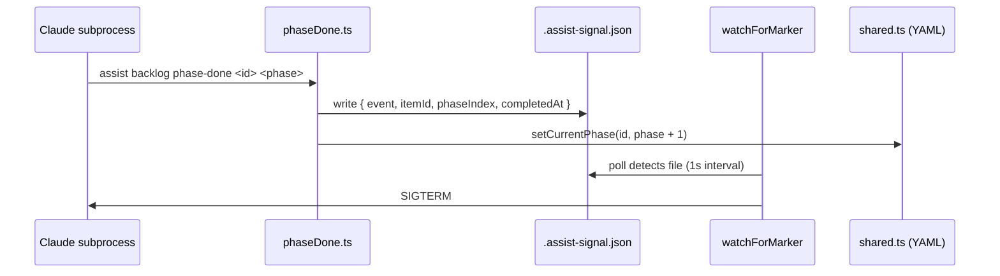

# Backlog Orchestration

## Workflow Contract

This is the core workflow that drives backlog item execution. Each item is broken into **phases**, and each phase runs in its own Claude subprocess.



### What the agent is told to do (per phase)

These instructions come from `buildPhasePrompt.ts`:

1. **Implement the phase tasks** — the prompt lists specific tasks, each with an optional `verify` hint
2. **Run `/verify`** — the prompt tells the agent to verify its own work before signalling completion
3. **Pause for manual checks** (if any) — the agent lists the manual checks and waits for the user to confirm they pass
4. **Pause on last phase** (always) — even without explicit manual checks, the last phase always asks the user to verify end-to-end before proceeding
5. **Signal done** — only after verify passes and user confirms (if required), the agent calls `assist backlog phase-done <id> <phase>`

### Manual checks

Most phases should NOT have manual checks — prefer automated verification. Manual checks are for things that are genuinely difficult to automate (visual appearance, UX flow, hardware interaction, etc.).

The **last phase always requires user confirmation**, even if it has no explicit `manualChecks`. This is the gate that determines whether the story is actually finished.

Phases define manual checks via the `manualChecks` field:

```yaml
plan:
  - name: Add search UI
    tasks:
      - task: Add search input component
      - task: Wire up to API
    manualChecks:
      - Verify search results appear within 200ms
      - Check that empty state shows placeholder text
  - name: Polish and edge cases    # last phase — always pauses for user
    tasks:
      - task: Handle network errors gracefully
```

### What the agent is NOT told to do

- **Write tests** — not explicitly required in the prompt. It only happens if `/draft` included a test task in the plan, or the agent decides to on its own.
- **Commit** — the agent is never told to commit. After all phases complete, `run.ts` prints "use /commit when ready" and the user takes over.

### Quality gates



| Gate | Who runs it | When | What happens on failure |
|---|---|---|---|
| Agent `/verify` | Claude subprocess | Before calling phase-done | Agent should fix and retry (prompt says "once verify passes") |
| Manual checks | User, prompted by agent | After /verify passes, before phase-done | Agent waits for user confirmation |
| Last-phase confirmation | User, prompted by agent | Always on the final phase | Agent waits — this is the "is the story done?" gate |
| Orchestrator `assist verify` | `resolvePhaseResult.ts` | After phase-done marker detected | User prompted: continue or abort |
| Final `/verify` | User | Before committing | User decides |

### What `/draft` controls

The `/draft` skill (`claude/commands/draft.md`) is where the workflow is authored. It defines:

- **Acceptance criteria** — shown to the agent in every phase prompt
- **Phase names and tasks** — the specific work the agent will do
- **Verify hints** — optional per-task verification instructions (e.g. "run the test suite", "check the output")
- **Manual checks** — optional per-phase checks the user must perform (keep these rare)

If you want the agent to write tests, add it as an explicit task in the plan. If you want a specific verification step, add a `verify` field to the task. The agent only reliably does what the plan tells it to do.

## Item Lifecycle



## `assist backlog next`



## `assist backlog run` — Phase Loop



## `executePhase` — Single Phase



## `resolvePhaseResult` — Post-Phase Decision



## Phase-Done Handshake



## Prompt Template

`buildPhasePrompt.ts` produces the following structure (shown for a mid-phase with manual checks):

```
You are implementing phase {N} of backlog item #{id}: {name}

Description: {description}

Acceptance criteria:
- {criterion 1}
- {criterion 2}

Phase {N}: {phase name}
Tasks:
- {task} (verify: {optional verify step})
- {task}

Focus ONLY on this phase. Do not work on other phases.
When you have completed all tasks for this phase, run /verify to check your work.

Before marking this phase as done, ask the user to perform these manual checks:
- {check 1}
- {check 2}

Wait for the user to confirm all manual checks pass before proceeding.

Once verify passes and the user confirms, run: assist backlog phase-done {id} {phase}
```

For the **last phase** without explicit manual checks, the prompt instead includes:

```
This is the final phase. Before marking it as done, ask the user to manually verify
that the feature works end-to-end and all acceptance criteria are met.
Wait for the user to confirm before proceeding.
```

## File Map

| File | Role |
|---|---|
| `run.ts` | Entry point — phase loop |
| `next.ts` | Pick or resume an item |
| `executePhase.ts` | Orchestrate a single phase |
| `buildPhasePrompt.ts` | Generate the agent prompt |
| `spawnClaude.ts` | Spawn `claude` subprocess with stdio |
| `watchForMarker.ts` | Poll for `.assist-signal.json`, kill on detect |
| `phaseDone.ts` | Write marker + advance `currentPhase` |
| `resolvePhaseResult.ts` | Post-phase decision (advance / retry / abort) |
| `shared.ts` | SQLite persistence with JSONL sync |
| `types.ts` | Zod schemas for `BacklogItem`, `PlanPhase` |
