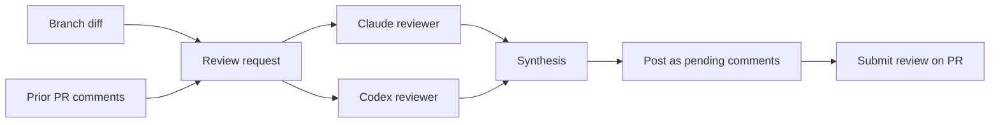
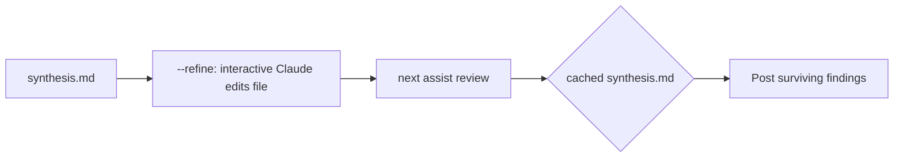
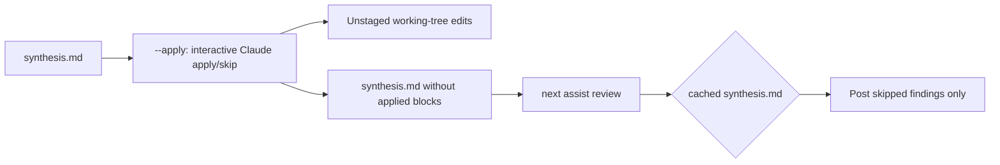

# `assist review`

Orchestrates two independent LLM code reviewers (Claude and Codex), consolidates their findings into a single synthesis, and posts the result as pending line comments on the current PR.

## End-to-end flow

## Key files

- `review.ts` — entry point; wires context, paths, prior comments, pipeline, and posting.
- `gatherContext`, `buildReviewPaths` (in `buildRequest.ts`, `buildReviewPaths.ts`) — derive the working set. The diff comes from the open PR (base SHA → head SHA via `gh pr diff`), not a local `base...HEAD` range, so stale local base branches don't pollute the review. Fails fast with a clear message if no PR exists for the current branch.
- `fetchExistingComments.ts` — pulls PR review comments via REST (`--paginate`) and enriches them with thread IDs / resolved state via GraphQL. Returns `null` when no PR exists.
- `formatPriorComments.ts` — groups comments into threads (by `threadId`, falling back to `inReplyToId`) and renders the `## Prior review comments` section.
- `buildRequest.ts` — assembles `request.md` (branch metadata, changed files, optional prior comments, unified diff).
- `runReviewers.ts` — runs Claude and Codex in parallel. Skips a reviewer when its output file already exists (caching across re-runs).
- `synthesise.ts` / `buildSynthesisStdin.ts` — consolidates the two reviews. The synthesis prompt defines the `Source` enum including `already-raised` for findings substantively covered by a prior comment.
- `parseFindings.ts` / `partitionFindings.ts` — parse `synthesis.md` and split findings into `lineBound`, `unlocated`, and `alreadyRaised` buckets.
- `postReviewToPr.ts` / `postAndMaybeSubmit.ts` / `postFindings.ts` — post line-bound findings as pending comments and optionally submit the review.

## Re-running on the same PR

The review directory is keyed by `branch-shortSha`, so re-running with no new commits hits the same folder. Existing `claude.md` / `codex.md` / `synthesis.md` are reused unless `--force` is passed. Findings the synthesis tags as `already-raised` (because they overlap with prior comments fetched in step 4) are filtered out before posting, so a second run on an unchanged PR posts zero new comments.

## `--refine`

`assist review --refine` runs the pipeline up through synthesis and then, instead of posting, launches an interactive Claude session (`runRefineSession.ts`) with `synthesis.md` open. The agent investigates each finding, walks the user through it, and edits `synthesis.md` in place — dropping, editing, or appending blocks using the format `parseFindings.ts` expects.

Because the file is edited in place, a subsequent `assist review` (no flag) hits the cached `synthesis.md` via `cachedReviewerResult` and posts only the surviving / appended findings as pending comments. `--force` re-runs the pipeline before refining; `--submit` is ignored when `--refine` is set because nothing is posted in the refine step itself.

## `--apply`

`assist review --apply` also runs the pipeline up through synthesis and then launches an interactive Claude session (`runApplySession.ts`), but with a different goal: walk every non-`already-raised` finding one at a time, ask the user `apply / skip`, and on `apply` edit the referenced code in place (unstaged) while removing that finding's `### Finding:` block from `synthesis.md`. Skipped findings stay in `synthesis.md` untouched. Nothing is posted to the PR during `--apply`.

Because applied blocks are deleted from `synthesis.md` and skipped blocks remain, a subsequent `assist review` (no flag) hits the cached `synthesis.md` via `cachedReviewerResult`, parses the surviving blocks via `parseFindings` / `partitionFindings`, and posts only the skipped (plus any `already-raised`) findings as pending comments. `--force` re-runs the pipeline before the apply session; `--submit` is ignored; combining `--apply` with `--refine` errors out.

