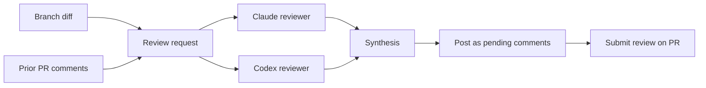
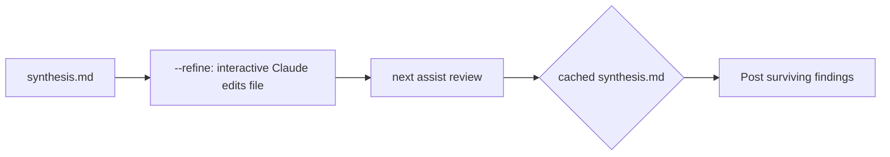
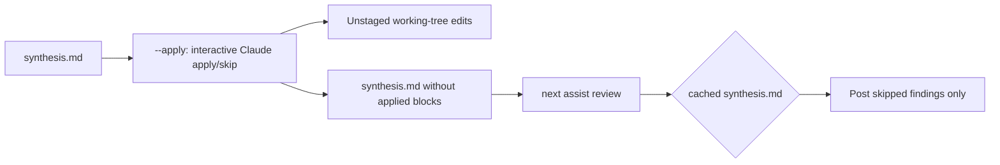
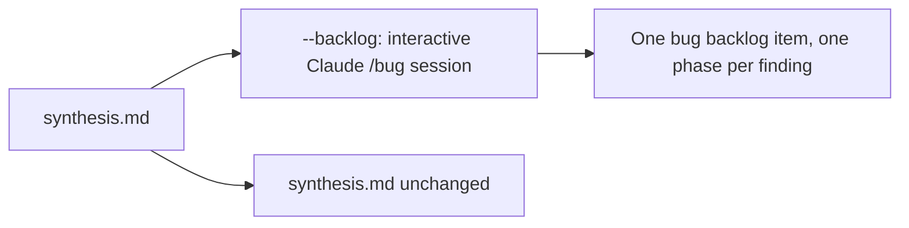

# `assist review`

Orchestrates two independent LLM code reviewers (Claude and Codex), consolidates their findings into a single synthesis, and posts the result as pending line comments on the current PR.

`assist review` diffs the open PR for the current branch, fetches prior PR comments, and posts the synthesis as pending line comments on the PR. `assist review <number>` first runs `gh pr checkout <number>` and then performs the same review on that branch; if the checkout fails (dirty working tree, unknown PR number), gh/git's error is surfaced and the review aborts.

## End-to-end flow

```mermaid
flowchart LR
    Diff[Branch diff] --> Request[Review request]
    PriorComments[Prior PR comments] --> Request
    Request --> Claude[Claude reviewer]
    Request --> Codex[Codex reviewer]
    Claude --> Synthesis[Synthesis]
    Codex --> Synthesis
    Synthesis --> Post[Post as pending comments]
    Post --> Submit[Submit review on PR]
```

## Key files

- `review.ts` — entry point; validates flags, resolves the repo root, checks out the PR (`gh pr checkout <number>`) when a number is supplied, and runs `reviewPr`.
- `reviewPr.ts` — the review pipeline.
- `gatherContext`, `buildReviewPaths` (in `buildRequest.ts`, `buildReviewPaths.ts`) — derive the working set. The diff comes from the open PR (base SHA → head SHA via `gh pr diff`), not a local `base...HEAD` range, so stale local base branches don't pollute the review. Fails fast with a clear message if no PR exists for the current branch.
- `fetchExistingComments.ts` — pulls PR review comments via REST (`--paginate`) and enriches them with thread IDs / resolved state via GraphQL. Returns `null` when no PR exists.
- `formatPriorComments.ts` — groups comments into threads (by `threadId`, falling back to `inReplyToId`) and renders the `## Prior review comments` section.
- `buildRequest.ts` — assembles `request.md` (branch metadata, changed files, optional prior comments, unified diff).
- `buildReviewerStdin.ts` — the reviewer prompt. Besides correctness, it has reviewers flag tautological and vacuous tests added or changed by the PR (mock-returns-stub assertions, expected values derived from the code under test, assertion-free tests, snapshots of mocked output), recommending an independent expected value or deletion: minor by default, major when the test is the sole coverage of a changed behaviour.
- `runReviewers.ts` — runs Claude and Codex in parallel. Skips a reviewer when its output file already exists (caching across re-runs).
- `synthesise.ts` / `buildSynthesisStdin.ts` — consolidates the two reviews. The synthesis prompt defines the `Source` enum including `already-raised` for findings substantively covered by a prior comment, and keeps tautological-test findings rather than downgrading them below minor as taste.
- `parseFindings.ts` / `partitionFindings.ts` — parse `synthesis.md` and split findings into `lineBound`, `unlocated`, and `alreadyRaised` buckets.
- `postReviewToPr.ts` / `postAndMaybeSubmit.ts` / `postFindings.ts` — post line-bound findings as pending comments and optionally submit the review.

## CI path (`ci/reviewCiReview.ts`)

The `/review-ci` skill's `review.mjs` is `ci/reviewCiReview.ts` bundled by tsup, calling `reviewPr` with a `ci` option so CI and local reviews share one pipeline. It differs from a local run in that:

- config comes from the `REVIEW_CI_*` env (`ci/readReviewCiEnv.ts`), never `loadConfig`;
- the PR number is read from `GITHUB_EVENT_PATH` and pinned with `pinCurrentPr`, so every `prs/shared` lookup and `fetchPrDiffInfo` resolve that PR on the detached checkout instead of by branch; there is no `gh pr checkout` or worktree move, and no activity is emitted;
- each of the three slots (the `claude.md` reviewer, the `codex.md` reviewer, synthesis) names its own harness and model (`REVIEW_CI_REVIEWER_1`/`_2`/`_SYNTHESIS` as `claude:<model>` or `codex:<model>`), and `runSlot.ts` runs whichever harness a slot names; locally the slots keep Claude, Codex and Claude;
- `ci/buildCiReviewerModels.ts` gives a Claude slot `--model` plus `ANTHROPIC_BASE_URL`/`ANTHROPIC_AUTH_TOKEN`, or with a `foundry` API key `CLAUDE_CODE_USE_FOUNDRY`/`ANTHROPIC_FOUNDRY_BASE_URL`/`ANTHROPIC_FOUNDRY_API_KEY` (Foundry's Anthropic endpoint takes a key as `x-api-key`, a Bearer token being read as Entra), and a Codex slot the provider `-c` overrides, from the endpoints `ci/deriveEndpoints.ts` derives;
- with `foundry` and `REVIEW_CI_AZURE_CLIENT_ID` set, `ci/resolveReviewCiToken.ts` uses an Entra token instead of the key, sent as a Bearer token to both endpoints: in a workflow it exchanges the GitHub OIDC token for one (`ci/exchangeGithubOidcToken.ts`), locally it reads `az account get-access-token`;
- the pipeline runs strict: any reviewer failure skips synthesis, and a failed pipeline exits 1 before anything is posted;
- posting runs with `prompt: false, submit: true`, so findings post and a `COMMENT` review is submitted with no spinners or prompts.

## Re-running on the same PR

The review directory is keyed by `branch-shortSha`, so re-running with no new commits hits the same folder. Existing `claude.md` / `codex.md` / `synthesis.md` are reused unless `--force` is passed. Findings the synthesis tags as `already-raised` (because they overlap with prior comments fetched in step 4) are filtered out before posting, so a second run on an unchanged PR posts zero new comments.

## `--refine`

`assist review --refine` runs the pipeline up through synthesis and then, instead of posting, launches an interactive Claude session (`runRefineSession.ts`) with `synthesis.md` open. The agent investigates each finding, walks the user through it, and edits `synthesis.md` in place — dropping, editing, or appending blocks using the format `parseFindings.ts` expects.

Because the file is edited in place, a subsequent `assist review` (no flag) hits the cached `synthesis.md` via `cachedReviewerResult` and posts only the surviving / appended findings as pending comments. `--force` re-runs the pipeline before refining; `--submit` is ignored when `--refine` is set because nothing is posted in the refine step itself.

```mermaid
flowchart LR
    Synthesis[synthesis.md] --> Refine[--refine: interactive Claude edits file]
    Refine --> Next[next assist review]
    Next --> Cached{cached synthesis.md}
    Cached --> Post[Post surviving findings]
```

## `--apply`

`assist review --apply` also runs the pipeline up through synthesis and then launches an interactive Claude session (`runApplySession.ts`), but with a different goal: walk every non-`already-raised` finding one at a time, ask the user `apply / skip`, and on `apply` edit the referenced code in place (unstaged) while removing that finding's `### Finding:` block from `synthesis.md`. Skipped findings stay in `synthesis.md` untouched. Nothing is posted to the PR during `--apply`.

Because applied blocks are deleted from `synthesis.md` and skipped blocks remain, a subsequent `assist review` (no flag) hits the cached `synthesis.md` via `cachedReviewerResult`, parses the surviving blocks via `parseFindings` / `partitionFindings`, and posts only the skipped (plus any `already-raised`) findings as pending comments. `--force` re-runs the pipeline before the apply session; `--submit` is ignored; combining `--apply` with `--refine` errors out.

```mermaid
flowchart LR
    Synthesis[synthesis.md] --> Apply[--apply: interactive Claude apply/skip]
    Apply --> Edits[Unstaged working-tree edits]
    Apply --> Trimmed[synthesis.md without applied blocks]
    Trimmed --> Next[next assist review]
    Next --> Cached{cached synthesis.md}
    Cached --> Post[Post skipped findings only]
```

## `--backlog`

`assist review --backlog` runs the pipeline up through synthesis and then, instead of posting, launches an interactive Claude session (`runBacklogSession.ts`) running the `/bug` flow. The session files all findings — including `already-raised` ones — as a single bug backlog item with one phase per finding, each phase capturing the finding's Location, Impact, and Recommendation.

`synthesis.md` is left untouched, so a subsequent `assist review` (no flag) still hits the cached file and can post as usual. `--submit` is ignored when `--backlog` is set because nothing is posted; combining `--backlog` with `--refine` or `--apply` errors out.

```mermaid
flowchart LR
    Synthesis[synthesis.md] --> Backlog[--backlog: interactive Claude /bug session]
    Backlog --> Item[One bug backlog item, one phase per finding]
    Synthesis --> Untouched[synthesis.md unchanged]
```
